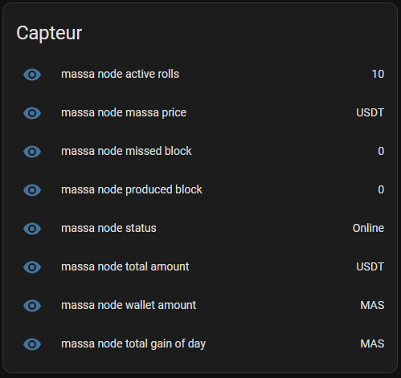

# Massa Node for Home Assistant
## Description
This integration provides some entities for tracking your node status.
- node status
- wallet info
- stack info

## Installation
To install this integration, follow these steps.

- add the custom_components folder into the home assistant config folder
- go to Settings > Devices & services > add integration
- select Massa Node
- fill out the form
- done !

## Frontend card
You can also add a card > [here](https://github.com/kevin-briand/HA-massa-node-card)
