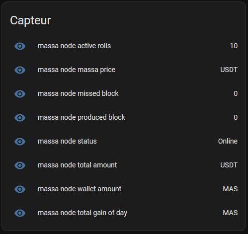

# Massa Node for Home Assistant

Follow your [Massa](https://massa.net) staking node from Home Assistant: node connectivity,
wallet balance, rolls, produced/missed blocks and the gain of the day.



## Entities

Each configured wallet creates a **Massa Node** device with:

| Entity | Description |
| --- | --- |
| Status (binary sensor) | On when the node answers its public API |
| MAS price | Last MAS/USDT price (Bitget, refreshed every 5 min) |
| Wallet balance | Final balance of the address |
| Wallet balance with rolls | Balance + rolls × 100 MAS + deferred credits |
| Wallet value | Previous value × MAS price |
| Gain of the day | Variation of the wallet (rolls included) since midnight |
| Active rolls | Rolls active for the current cycle |
| Produced / missed blocks | Over the cycles kept by the node |
| Block miss rate | Missed / (produced + missed) |
| Current cycle, node version | Diagnostic entities |

Buying or selling rolls does not change the gain of the day: rolls are counted at 100 MAS.

Several wallets can be added, and the host/port can be changed later with **Reconfigure**.

## Installation

### With HACS
- Go to the HACS panel
- Select the 3 dots in the top right corner > Custom repositories
- Paste https://github.com/kevin-briand/massa_node and select the *Integration* category
- Download **Massa Node**, then restart Home Assistant
- Go to Settings > Devices & services > Add integration > **Massa Node**

### Manual
- Copy `custom_components/massa_node` into the `custom_components` folder of your configuration
- Restart Home Assistant, then add the integration as above

Home Assistant 2025.2 or newer is required.

## Upgrading from 1.x

The configuration is migrated automatically. Existing entities keep their entity id, except
`sensor.massa_node_status` which is replaced by a connectivity binary sensor.

## Development

```bash
python3.13 -m venv .venv && . .venv/bin/activate
pip install -r requirements.test.txt
pytest
```

## Frontend card

A dedicated card is available [here](https://github.com/kevin-briand/HA-massa-node-card).
